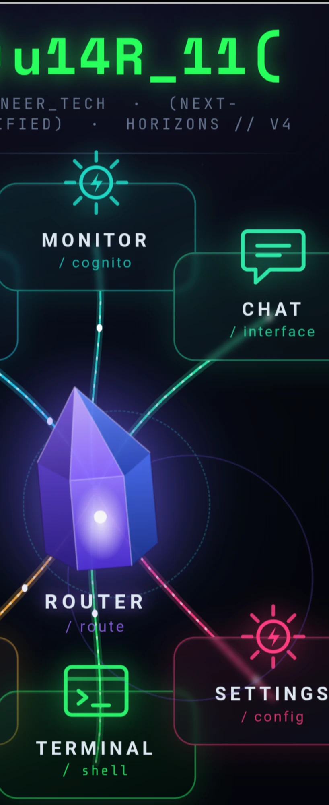
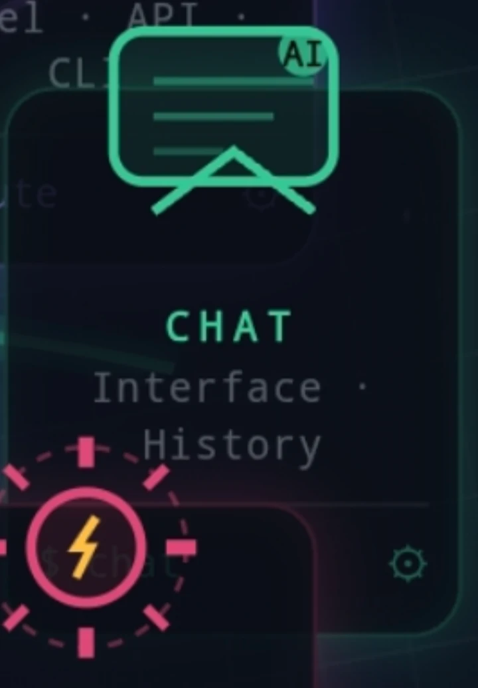
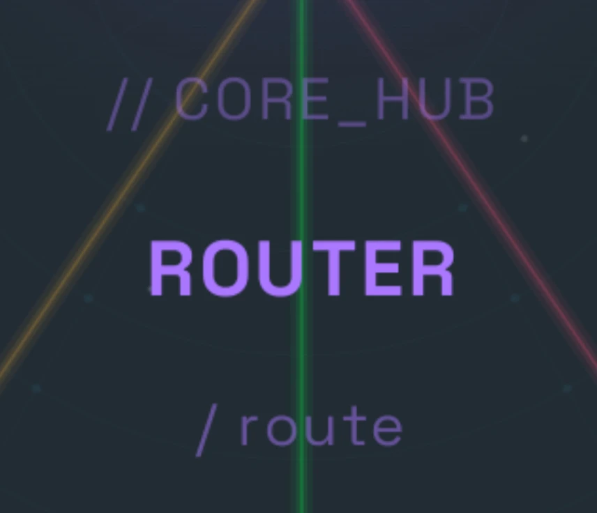
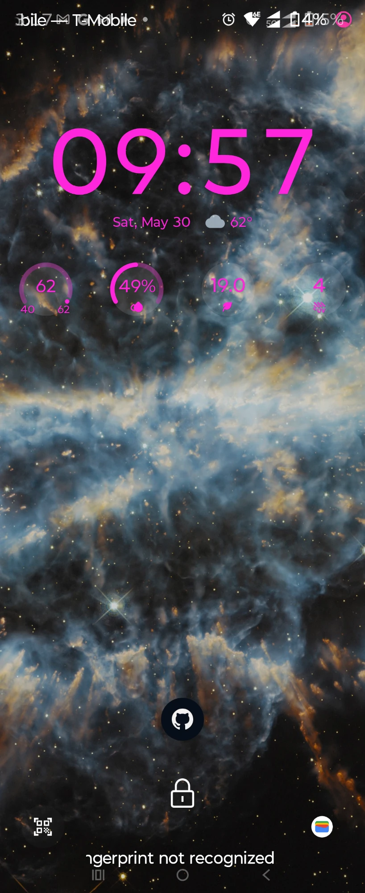

# HOME-REDESIGN-SPEC — Living Spec (image-first, hand session-to-session)

> **What this is.** The canonical, operator-approved specification for the
> Novus Agenti **home screen** (`HomeGrid.kt`) redesign. Every section leads
> with the **reference image on top**, then the **operator's own words
> (verbatim)**, then the distilled spec. Update **in place** as direction
> refines. When a home-screen visual task starts, READ THIS FIRST.
>
> **Guiding principle.** The renders here are a **visual TARGET / mockup —
> REFERENCE ONLY.** They are NOT screenshots of a live or near-complete app;
> **nothing in the current UI is anywhere near complete.** Match the target,
> make the specific edits below, don't reinvent. Past runs failed by rebuilding
> everything at once and by downgrading instead of upgrading — this spec exists
> to prevent that.
>
> **Verification rule.** Every change MUST end with a real rendered screenshot
> (device/emulator) compared against the references before it's "done." The
> cloud build container has **no Android SDK**, so the operator is the on-device
> visual check — ship in small, verifiable passes, never one blind dump.

---

## 0 · The target render — REFERENCE ONLY (not a live screenshot)

> **Operator:** *"Main screen reference shot doesn't exist — replace all mention
> of it as a live artifact / interface. Nothing in this user interface is almost
> complete. That picture is reference only."*
> *"This is one of the most important pictures."*

**Spec.** This is a **reference mockup of the TARGET**, not the live app and not
"almost complete." Black bg; green `MO)u14R_11(` banner; the 7-element wheel;
bottom status nodes; input bar. Use strictly as the destination to build toward.

**What's RIGHT about this picture (operator, verbatim):**
> *"The overall spacing ratio, size ratios, color hues, placement of the upper
> logo and the bottom chat bar and bottom configuration nodes … those are the
> only two things on here that are perfect."*

**What's WRONG about this picture (operator, verbatim, top → bottom):**
> *"Starting from the top — wrong font for the logo, correct color, wrong font."*
> *"The motto underneath it — correct color, correct font, wrong format. It
> should read in one continuous line across the screen and fit in one line
> unbroken, with Next-Gen Certified being in parentheses and the Horizons
> v-point-whatever on the bottom right."*
> *"The background styling — the color was almost perfect, background styling's
> off."*
> *"The labeling is almost correct on the tiles, the colors are correct, but the
> tiles themselves are the wrong style."*
> *"The 2 o'clock, 4:00, 8:00 and 10:00 tiles are too crowded to the north and
> the south."*
> *"The bottom row of three tiles could expand down below just a tiny bit — that
> would free up more space for the labeling of the router hub."*

*(Each of these is expanded in the relevant section below — banner §5, background
§7, tiles §2, layout §1.)*

---

## 1 · Layout geometry

> **Operator:** *"The tile layout is 12 o'clck – 2:00 – 4:00 – 6 o'clock –
> 8:00 – 10:00."*
> *"All seven of those should be pretty symmetrical … that wheel itself is just
> slightly bumped up a little bit."*
> *"The 2 o'clock 4:00 8:00 and 10:00 tiles are too crowded to the north and the
> south."*
> *"The bottom row of three tiles could expand down below just a tiny bit — that
> would free up more space for the labeling of the router hub."*

**Spec.**
- 7 elements on a clock face: **12 Monitor · 2 Chat · 4 Settings · 6 Terminal ·
  8 Archives · 10 Horizons**, Router hub in the center.
- All 7 **symmetrical**; Router centered in the ring. The **whole wheel is
  nudged slightly UP** as a unit.
- **Spread the 2/4/8/10 tiles** — they're too crowded toward top & bottom center.
- **Bottom row can extend down a touch** to free room for the Router hub label.

---

## 2 · Tiles — general

> **Operator:** *"This is EXACTLY WHAT I WANT TILES TO LOOK LIKE: BESIDES A
> COUPLE ICON SWAPS. SAME COLORS LABELS STYLE. EVERYTHING."*
> *"The labeling is almost correct on the tiles, the colors are correct, but the
> tiles themselves are the wrong style."*

> **Color note — Chat green ≠ Terminal green.** *"Notice the deeper black and
> the brighter green in terminal."* Terminal = **deeper near-black card bg +
> brighter matrix-green**; Chat = its own **softer green**. Do NOT equalize.

**Label format (every tile):** **TITLE** · `/slug` · short **subtitle** · a
**bottom prompt line** (`$_…`). Keep colors/sizes/style; only the specific
icon/label edits below change.

### 12:00 — MONITOR (teal/cyan)

> **Operator:** *"That's what the monitor tile icon looks like: it should say PC
> instead of AI."* … *"I told you to put the PC in the monitor icon instead of
> AI."*
> *"Monitor /cognito, library. And in the bottom prompt line of the tile can
> read $_browser."*

**Spec.** Labels: `MONITOR` · `/cognito` · `library` · `$_browser`. Icon: the
**display/screen** glyph (rounded rect, 2 inner lines, tail) with a **`PC`**
badge (replacing "AI"). No "AI" anywhere.

### 2:00 — CHAT (green — its OWN softer green)

> **Operator:** *"What's correct about this chat tile: the size, the labeling,
> the overall style and color. What's incorrect: the icon and the fact that
> another tile is overlapping it. The icon should match the second picture."*
> *"Chat /interface, tools, bottom prompt line of the tile can read $_model."*

**Spec.** Labels: `CHAT` · `/interface` · `tools` · `$_model`. Keep size/style/
green. **Icon → clean simple speech bubble** (2nd pic; NOT hub-and-spoke, NOT
the display/PC glyph). **Fix the tile overlap.**

### 4:00 — SETTINGS (pink/crimson)

> **Operator:** *"Exactly what settings will look like, 4pm pos. Same coloring
> same size proportions same titles."*
> *"Settings /config, vault, bottom prompt line of the tile can read $_utils."*

**Spec.** Labels: `SETTINGS` · `/config` · `vault` · `$_utils`. Icon **no
change** — pink sun/flash in a dashed ring.

### 6:00 — TERMINAL (green — deeper near-black bg + brighter matrix-green)

> **Operator:** *"This is exactly what terminal tile will look like (6:00
> position)."*
> *"Terminal /shell, commands, bottom line of the tile can read $_bash."*

**Spec.** Labels: `TERMINAL` · `/shell` · `commands` · `$_bash`. Icon **no
change** — green terminal-window (dots + `>_`). Deeper black bg, brighter green.

### 8:00 — ARCHIVES (amber) — currently mislabeled ARTIFACTS

> **Operator:** *"Archives is actually labeled — instead of ARTIFACTS it'll be
> ARCHIVES."*
> *"Archive /logs, artifacts, in the bottom line can read $_files."* *"Archives
> is at 8:00."*

**Spec.** Labels: `ARCHIVES` (was ARTIFACTS) · `/logs` · `artifacts` ·
`$_files`. Icon **no change** — amber stacked-documents.

### 10:00 — HORIZONS (blue)

*(same reference image as Archives above)*

> **Operator:** *"Horizon sun gets an amber color."* *"Horizons is at 10:00."*
> *"Horizons /about, credits, bottom line can read $_version.s … or $_.home"*
> (cleanest → `$_.home`).

**Spec.** Labels: `HORIZONS` · `/about` · `credits` · `$_.home`. Icon: the
**sun** element turns **amber**; the rest of the icon (blue horizon line, pale
pinkish-purple arch) stays blue.

---

## 3 · Center hub — ROUTER

> **Operator:** *"That whole hub was a reference to what the entire router hub
> should look like — the plasma tubes, the nodes, the platform perimeter, the
> protruding crystal. Swap out the dome for the white sun. Make the crystal a
> little bit bigger. Give it the violet hue."*
> *"The hub that … has nothing to do with the app … that's what the crystal
> should look like, just slightly larger than that. That wizard-hat looking
> thing [the past build's purple crystal] is grossly oversized already."*
> *"Keep the center glowing sun aura instead of the dome."*
> *"The router doesn't just have the purple color, it has the white sun or a glow
> as well permeating from underneath."*
> *"Router is always white — I've never said it's the text, I mean the ROUTER
> [label] is white; obviously the icon is the violet."*
> *"No /route at the bottom. The core_hub slug is at the top right under the
> icon. `$_Statio` only thing underneath ROUTER."* (chose `$_Statio` over
> `$_Nodus`).
> *"Incorporate the chipsets as nodes … six connector setup, basically six nodes
> around center hub."*

**Spec.**
- Build the **entire hub after the Agent Platform reference**: plasma tubes,
  nodes, platform perimeter, protruding central faceted crystal.
- **Dome → white sun / radial aura** (no dome, no concentric rings).
- **Crystal:** hexagonal faceted gem **shaped like the Agent-Platform gem, just
  slightly LARGER than that gem** — i.e. **much smaller** than the current
  oversized "wizard-hat" crystal (shrink it). **Violet** gem with a **white glow
  from underneath**.
- **Label (stacked under the icon):** `// CORE_HUB` slug (top, under the icon) →
  **`ROUTER` big, WHITE** → `$_Statio` (only line under it). **No `/route`.**
  The crystal **icon is violet**; the **ROUTER word is white**.
- Chipsets-as-nodes / 6 connectors — see `05-router-circuit-blue-chip.jpg`.

---

## 4 · Connector cords

*(see `07-ai-orchestration-hub.webp` and `08-router-label.webp` above)*

> **Operator:** *"The plasma tubing styling of the connector cords."*

**Spec.** Six cords, one from each tile-node into the hub, styled as glowing
**plasma tubes** (soft outer glow → bright core), **each in its tile's color**
(green→Terminal, amber→Archives, pink→Settings, teal/blue→Monitor/Chat/Horizons),
with **beads/nodes** running along each tube.

---

## 5 · Banner (top logo)

> **Operator:** *"Wrong font for the logo — correct color, wrong font."*
> *"The motto underneath: correct color, correct font, wrong format. It should
> read in one continuous line across the screen and fit in one line unbroken,
> with (Next-Gen Certified) being in parentheses and the Horizons v-whatever on
> the bottom right."*
> *"Here is the matching font for the logo."*

**Spec.** Placement is **perfect — don't move it.** Logo: keep green, **change
the font** to match the chunky monospace/terminal font in the reference. Motto:
**one unbroken line**, `(NEXT-GEN CERTIFIED)` in parentheses, `HORIZONS // V4`
on the **bottom-right**.

---

## 6 · Colors — header / bold / outline

> **Operator:** *"Example of the purple text on the nebula screen — that's what
> the header text, bold text and outline colors should be."*
> *"In the nebula screen the header text and outlines are purple."*

**Spec.** **Header text, bold text, and outline colors = the purple/magenta from
the nebula lock-screen** (the `09:57` clock color). Note the ONE exception: the
**ROUTER hub title is white**, not purple (see §3).

---

## 7 · Background (home)

> **Operator:** *"Background stylings off"* (hue almost right).

**Spec.** Base already shipped: deep black + faint blue tint, brighter/haloed
stars, more-visible astral telemetry map (`drawAstralBackground`). Styling still
needs a polish pass after the forefront layers land.

---

## 8 · Chat bar (bottom input)

> **Operator:** *"When you hold down on the chat bar, that chat bar should work
> like a mini user interface, not just a shortcut to open up the chat tile — if
> you hold down on it, it pops up to 1/3 screen for quick inference."*

**Spec.** Placement + bottom status nodes are **perfect — don't move them.**
**Hold** the chat bar → it expands to a **~⅓-screen mini inference UI** (not just
a navigate-to-Chat shortcut). This is why the wheel sits slightly high.

---

## 9 · Easter eggs & guardians

> **Operator:** *"Don't forget about the crash log / easter egg goat pop up and
> the screen timeout guardian chonk."*

**Spec.**
- **GOAT — crash-log easter egg.** On runtime crash/fail the goat pops up
  (`// GOAT_SAYS_NO`) with a synthesized bleat; 7 banner taps → `// GOAT_UNLOCKED`.
  Already wired (`HomeGrid.kt` `showGoat` / `playGoatBleat`).
- **CHONK — screen-timeout guardian.** Idle/screen-timeout screensaver loads the
  **chonky orange cat** from device storage. Partly wired (`Screensaver.kt`).

---

## 10 · What is PERFECT — do not touch

> **Operator:** *"The overall spacing ratio, size ratios, color hues, placement
> of the upper logo and the bottom chat bar and bottom configuration nodes …
> those are perfect."*

- Top **logo placement** · **bottom chat bar** placement · **bottom status
  nodes** (ASR/LLM/TTS/MLLM/VAG) placement.
- Overall **spacing ratios, size ratios, color hues**.

---

## 11 · Panel backgrounds (separate track — mostly shipped)

Each of the 8 panels has a procedural background; **4 are also uploadable-wallpaper
capable** (image fully replaces procedural, tiles go semi-transparent).

| Panel | Procedural bg | Wallpaper? | Reference |
|---|---|---|---|
| Home | astral (deep black + stars + telemetry) ✅ | no | `01-target-full-home.webp` |
| Terminal | Matrix rain (`fakesteak` fork) | no | `18-matrix-rain.png` |
| Router | circuit-board / chip nodes | no | `05-router-circuit-blue-chip.jpg` |
| Monitor | sliding oscilloscope (animated) | no | `17-oscilloscope.webp` |
| Chat | wet blue-grey slate stone ✅ | yes | `14-stone-slab.webp` |
| Horizons | butterfly nebula (gold/blue-white) ✅ | yes | `13-nebula-wallpaper.webp` |
| Archives | vintage film strip | yes | `16-film-strip.jpg` |
| Settings | brushed-steel vault door | yes | `15-vault-door.jpg` |

Nebula palette: the reference is **gold + blue-white, minimal purple** (image
wins over the old "purple/blue/gold" text); it's also a candidate for a **real
image asset** vs procedural.

---

## 12 · Status ledger

- ✅ Home background layer (deep black + stars + telemetry) — shipped.
- ✅ Panel backgrounds: Chat slate, Horizons nebula, deeper Router/Monitor bases.
- ✅ Uploadable wallpapers on Chat/Horizons/Archives/Settings.
- ⛔ Home wallpaper — reverted (home is procedural only).
- ⬜ **Home forefront redesign — PENDING.** Banner font/format, tile icon/label
  swaps, tile spacing, Router hub (crystal/label/cords), colors, background
  polish, chat-bar hold-to-⅓ mini UI.

---

## 13 · Open / to-confirm

- **Old CORE_HUB render** (`21-old-corehub.webp`) = the washed-out earlier
  version — kept as "what to avoid."
- **Exact tile card style** ("wrong style") isn't fully pinned — resolve against
  the target render before restyling cards.
- **Logo font asset:** exact typeface likely needs a bundled `.ttf`;
  `FontFamily.Monospace` is the closest built-in stand-in until one is added.
