# HOME-REDESIGN-SPEC — Visual Definition Document

> **What this is.** The canonical, operator-approved visual specification for
> the Novus Agenti **home screen** (`HomeGrid.kt`). Each section has reference
> screenshots with exact written descriptions of what's right, what's wrong,
> and what the finished version must look like. When a home-screen visual task
> starts, READ THIS FIRST — every detail here is operator-verified.
>
> **THIS DOCUMENT MUST BE READ THOROUGHLY, IN FULL, EVERY TIME — NOT SKIMMED.**
> Every section carries a specific, deliberate instruction (size, color, font,
> composition, spacing). Skimming and pattern-matching against "similar enough"
> has produced wrong builds repeatedly. Read every word of every section before
> touching `HomeGrid.kt`. If a detail seems ambiguous, ask the operator — do
> not guess or extrapolate from a different section.
>
> **Verification rule.** Every change MUST end with a real on-device screenshot
> compared against the references before it's "done." The cloud build container
> has **no Android SDK** — the operator is the on-device visual check.
>
> **Image asset note.** Some reference screenshots below were pasted inline
> during a chat session and could not be auto-saved to the repo (Claude has no
> mechanism to write a pasted chat image to disk on its own). Those are marked
> **⚠ NOT YET SAVED** with a suggested filename — the operator needs to add
> the actual file to `wiki/home-redesign-img/` under that name so the link
> resolves. Everything else links directly to an existing file in that folder.

---

## 1 · Header / Logo

**Reference images:**
- ⚠ NOT YET SAVED — current build (session 20) full-home screenshot, what
  we have now. Suggested filename: `25-s20-current-build-full-home.png`
- 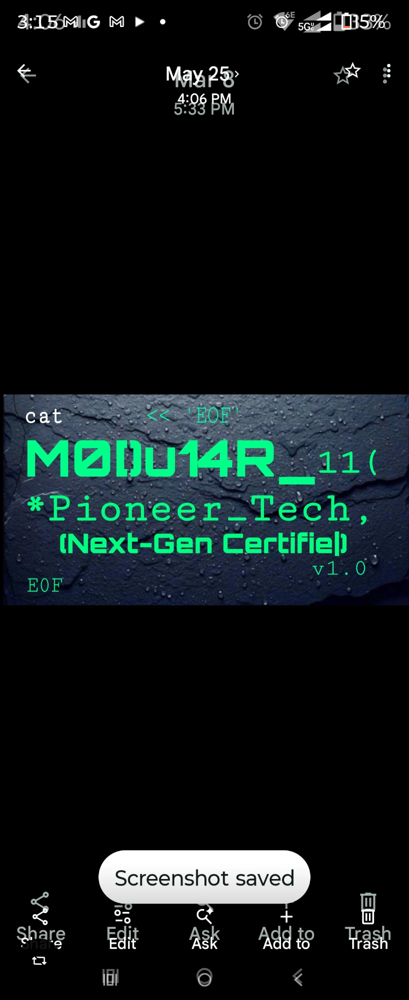 — the TARGET font
  (chunky blocky terminal face, `cat << 'EOF'` header, wet stone background)
- ⚠ NOT YET SAVED — prior build slogan closeup, dual-font `*Pioneer_Tech,`
  + `(Next-Gen Certified)` + `EOF` / `v1.0`. Suggested filename:
  `26-slogan-dual-font-closeup.png`

### Size

The logo text (`MØ[)u14R_11(`) should be approximately **1/3 larger** than it
is in the current build. The slogan line underneath (`*Pioneer_Tech,
(Next-Gen Certified)`) is **good size — don't change it.** The app label on
the bottom right (`HORIZONS // V4`) is **good size — don't change it.** The
faint purple divider line barely visible at the bottom of the header area is
**good** as long as it has **more contrast** once the background haze is
cleaned up.

### Location

- The faint purple divider line **stays where it is.**
- The app label (`HORIZONS // V4`) and slogan can both **drop down just a
  tiny bit.**
- The logo itself needs to **increase in size** as described above.
- **Logo and slogan both need to be centered on screen** (currently
  left-aligned).

### Color

- **Material teal** for the logo and slogan text — good, don't change.
- The faint purple (almost blacked-out purple) for the divider underline —
  **good, don't change.**

### Font

**The font is WRONG in the current build.** The logo font must match the
chunky blocky terminal typeface shown in `19-logo-font.webp` — the one from
the reference render with the `cat << 'EOF'` header and the wet stone
background. That is the target font.

The slogan is **dual font:**
- `*Pioneer_Tech,` — in monospace
- `(Next-Gen Certified)` — in the **same font as the logo** (the chunky
  blocky terminal face, NOT monospace)

### Text

Look at the reference font image — the `11(` portion is **smaller sized
font** and there is **no space between the underscore and `11(`**. That must
happen in our version: `MØ[)u14R_11(` with the `_11(` run together, no gap,
and `11(` rendered slightly smaller.

---

## 2 · Background Color and Style

**Reference images:**
- ⚠ NOT YET SAVED — current build (session 20) full-home screenshot —
  **trash, not acceptable.** Suggested filename:
  `25-s20-current-build-full-home.png` (same shot as §1)
- ⚠ NOT YET SAVED — prior build (session 20) full-home screenshot, the one
  with the large crystal, vivid status nodes, plasma cords — **this is the
  TARGET background quality.** Suggested filename:
  `27-prior-build-full-home-target.png`
- ⚠ NOT YET SAVED — V3 Horizons build with the grid overlay — **copy the
  STARS ONLY from this image, NOT the grid.** Suggested filename:
  `28-v3-horizons-grid-stars.png`

### What's wrong (current build)

The background has a haze/wash to it that flattens everything. It looks
washed out and lifeless compared to the prior builds.

### What's right (prior build, pic 2)

- The **center hue of the white sun** radiating from behind the crystal —
  that exact warmth and glow must be replicated.
- The **purple contrast of the crystal** — the violet stands out against the
  dark background with real depth. That same purple/dark contrast must be
  identical in the finished version.
- The **telemetry circles** (faint concentric rings around the hub area) —
  keep these, and add **2-3 more layered telemetry circles in varying sizes**,
  **not all in the same spot** — spread them around at different positions.

### Stars (from V3 build, pic 3)

Copy the **star field only** from the V3 build — the mild, scattered pinpoint
stars across the dark background. **Do NOT copy the grid overlay** from that
image, just the stars. Add maybe a **couple more stars** than what's shown
there, but **not too many more** — keep it subtle, not a galaxy.

---

## 3 · Aspect Ratio / Overall Proportions

**Reference images:**
- ⚠ NOT YET SAVED — current build (session 20) full-home screenshot, same
  as §1/§2 — filename `25-s20-current-build-full-home.png`
- ⚠ NOT YET SAVED — prior build (session 20) full-home screenshot, vivid
  status nodes, large crystal — the **TARGET aspect ratio** — same as §2's
  target shot — filename `27-prior-build-full-home-target.png`

### Definition

"Aspect ratio" here means the **ratio in size of every element in conjunction
with everything else on the screen** — how big the header is relative to the
tiles, how big the tiles are relative to the hub, how much space between the
wheel and the bottom bar, etc.

### Target

**Picture 2 (prior build) is the target** for overall proportions. Match it
for:
- **Header size** (logo + slogan area)
- **Tile size** and how they're **spread around the screen**
- **Spacing between the clock circle and the configuration nodes**
- **Size of the configuration nodes** (ASR/LLM/TTS/MLLM/VAG dots)
- **Chat bar size and style**

### What changes from picture 2

1. **Tile orientation** — the clock-face positions change per the tile
   sections below (don't copy pic 2's tile arrangement verbatim).
2. **Center hub size** — needs to be **a little smaller than pic 2** but
   **way bigger than pic 1** (current build). The current build's hub is
   tiny; pic 2's is slightly too large. Split the difference, leaning
   toward pic 2.
3. **Chat bar goes ABOVE the configuration nodes** — in pic 2 the chat bar
   is below the config nodes. Swap that: chat bar on top, config nodes on
   the bottom. Everything else about pic 2's chat bar and config nodes
   (size, style, color, design) stays identical.
4. **System bar padding** — keep the top padding (status bar) and bottom
   padding (gesture bar) that the current build has. Don't lose that.

---

## 4 · Tiles — General Style

**Reference image:** 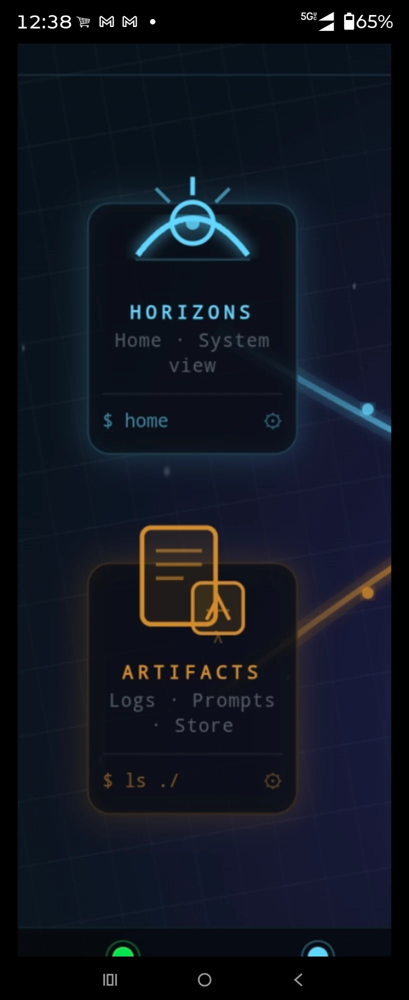
— prior build closeup (HORIZONS + ARTIFACTS tiles) — the best example of
what ALL tiles should look like.

### Card style (applies to every tile)

- **Dark black interior** on the card body — near-black, not translucent,
  not hazy. The tile background should be a deep solid black that contrasts
  sharply against the colored border/glow.
- **Colored hue on the outside** — each tile's accent color forms a subtle
  border/outline around the card edge.
- **Backlight glow** — the icon's backlight radiates upward/outward from
  behind the icon, which protrudes above the card's top edge. The glow
  should be vibrant and directional (emanating from the icon position), not
  a flat wash.
- **No haze.** The current build has a washed-out haze over everything that
  flattens the contrast. Remove it. The dark-to-bright contrast between
  the black card interior and the colored accents/glow is critical.

### Label sizing and formatting (applies to every tile)

- **Title** (e.g. `HORIZONS`, `ARCHIVES`) — the font needs to be
  **increased in size** from what's in the current build. Bold,
  letter-spaced, monospace.
- **Subtitle lines** — slug + descriptors (e.g. `/home · System view`),
  rendered in the tile's accent color at reduced opacity.
- **Prompt line** — should be **brighter** than currently rendered. Must
  have an **underscore after the dollar sign**: `$_` not `$`. The gear
  icon (`⚙`) sits on the far right of the prompt line.

### Icon sizing

Icons should be **properly sized** — matching the proportions shown in the
prior build reference (HORIZONS and ARCHIVES closeup). They protrude above
the card top edge with the backlit glow behind them. The current build's
icons are **way too small**.

---

## 4a · HORIZONS tile (10:00 position, blue)

**Reference images:**
- 
  — pic 1 — tile style/size reference (the arch-eye icon with rays,
  `HORIZONS` label, `Home · System view`, `$ home`)
- ⚠ NOT YET SAVED — pic 2, small thumbnail — icon COLOR reference (amber
  sun, blue horizon plane, pinkish-purple atmosphere arch). Suggested
  filename: `29-horizons-icon-color-thumbnail.png`

### Icon

The icon matches the **style and size of pic 1** (the arch/eye shape with
radiating rays above, half-circle horizon line below, dot in the center).
The **color scheme matches pic 2:**
- **Sun:** amber — can go **darker amber** than pic 2 shows, that's fine
- **Atmosphere arch** (the pinkish-purple curved line above): stays the
  same shade as pic 2
- **Horizon plane** (the blue straight line at the bottom): stays the same
  shade as pic 2, but the line in pic 1 is **a little too thin** — fatten
  it up slightly

### Composition (what the tile reads, top to bottom)

```
    [ICON protruding above card edge]


        H O R I Z O N S

       /home  ·  System
              view

    ─────────────────────────
    $_about                ⚙
```

Match the reference screenshot's spacing exactly: generous vertical
space between the title and subtitle, subtitle and divider, divider
and prompt line. Title is centered, subtitle is centered, prompt line
is left-aligned with gear right-aligned on the same baseline.

### Color

Blue accent (`TileHorizons` — `#40C4FF`). Card interior: near-black.

---

## 4b · ARCHIVES tile (8:00 position, amber)

**Reference image:** 
— prior build closeup — the amber stacked-documents icon. **Color and icon
are perfect as shown.** Only the label font size needs to increase.

### Icon

The stacked-documents / clipboard icon as shown in the reference — amber
outlined, two overlapping rectangles with inner lines. **Perfect as-is** in
style, size, and color. Do not change.

### Composition (what the tile reads, top to bottom)

```
         [ICON protruding above]

         ARCHIVES

      /logs  ·  Files
                ·  store
     ─────────────────────
     $_ls ./*.tar       ⚙
```

### Color

Amber accent (`TileArtifacts` — `#E8A838`). Card interior: near-black.

---

## 4c · TERMINAL tile (6:00 position, matrix green)

**Reference image:** 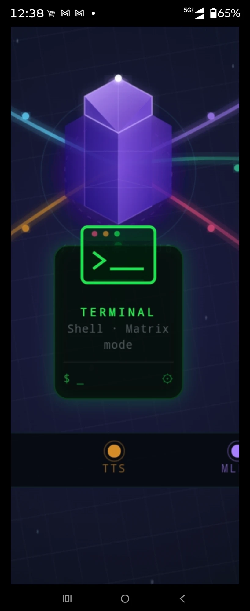
— prior build closeup — terminal window icon with red/amber/green dots,
`>_` prompt, green border. **Icon and size are perfect as shown.**

### Icon

The terminal window icon exactly as shown in the reference: rounded rect
with a green border, three colored dots (red, amber, green) in the title
bar, divider line under the title bar, `>_` prompt inside the window body.
**Perfect as-is** — do not change the icon style or size. Same aspect ratio
as all other tile icons.

### Style changes from reference

- **Backlighting** needs to be **brighter** than shown in the reference.
- **Prompt box** (the bottom `$_` line area) needs to be **better defined
  and brighter** — more contrast against the card background.
- **Card background** is **deeper near-black** (`TerminalCardBg` `#060A07`)
  — darker than all other tiles. This is intentional: Terminal green is
  brighter matrix-green on a deeper black, distinct from Chat's softer
  green.

### Composition

```
    [TERMINAL WINDOW ICON protruding above]


          T E R M I N A L

        /shell  ·  commands

    ─────────────────────────
    $_bash                 ⚙
```

### Color

Matrix green accent (`TileTerminal` — `#00FF41`). Card interior: deeper
near-black (`#060A07`).

---

## 4d · MONITOR tile (12:00 position, material teal)

**Reference image:** 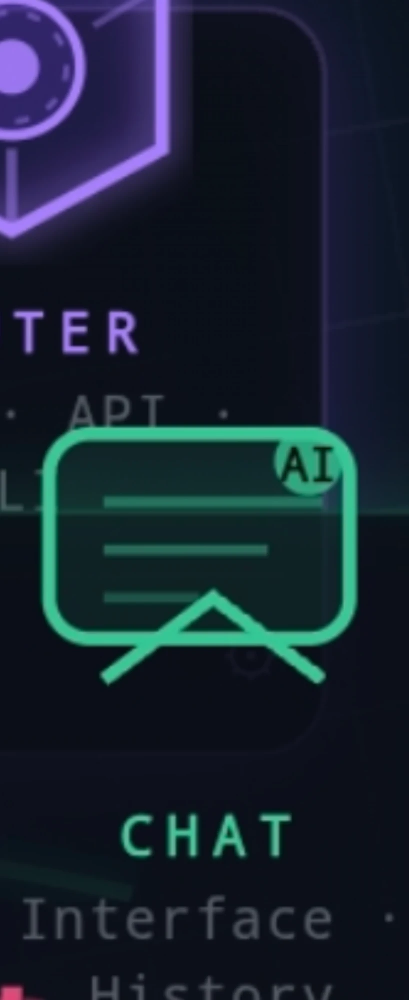
— display/screen glyph (rounded rect, inner lines, V-stand/tail, badge in
top-right). **Swap `AI` for `PC` on the badge.**

### Icon

The display/screen glyph as shown in the reference: rounded rectangle
with 2-3 inner horizontal lines, V-shaped stand/tail underneath, circular
badge in the top-right corner reading **`PC`** (NOT `AI`). Same aspect
ratio / size proportions as the Terminal icon and all other tile icons.

### Color

**Material teal** (`TileMonitor` — `#2DD4D9`) — matches the logo teal.
Card interior: near-black.

### Composition

```
    [DISPLAY/PC ICON protruding above]


          M O N I T O R

       /cognito  ·  library

    ─────────────────────────
    $_browser              ⚙
```

Title font bigger than current build, same as all tiles.

---

## 4e · CHAT tile (2:00 position, soft green)

**Reference images:**
- 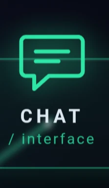 —
  pic 1 — the exact chat icon target: clean speech bubble, soft green,
  no badge, no stand
- ⚠ NOT YET SAVED — pic 2 — broader tile context showing icon size
  relative to card, label spacing, Settings icon visible below.
  Suggested filename: `30-chat-tile-broader-context.png`

### Icon

**Picture 1 is exactly what the Chat icon should look like.** Clean speech
bubble: rounded rectangle with 2-3 inner horizontal lines, small triangular
tail on the bottom-left pointing down. **No AI badge, no V-shaped stand** —
this is the speech bubble icon, NOT the monitor/display glyph. Same aspect
ratio / size proportions as all other tile icons.

### Color

**Soft green** (`TileChat` — `#4FE9A6`). This is its OWN green — distinct
from Terminal's brighter matrix green (`#00FF41`). Do NOT equalize them.
Card interior: near-black.

### Style

- **Backlighting brighter** than current build — match the green glow.
- Same tile card style as all others (dark black interior, colored border,
  protruding icon with backlit glow).

### Composition

```
    [SPEECH BUBBLE ICON protruding above]


            C H A T

      /interface  ·  tools

    ─────────────────────────
    $_model                ⚙
```

Title font bigger than current build, same as all tiles.

---

## 4f · SETTINGS tile (4:00 position, pink/crimson)

**Reference image:** 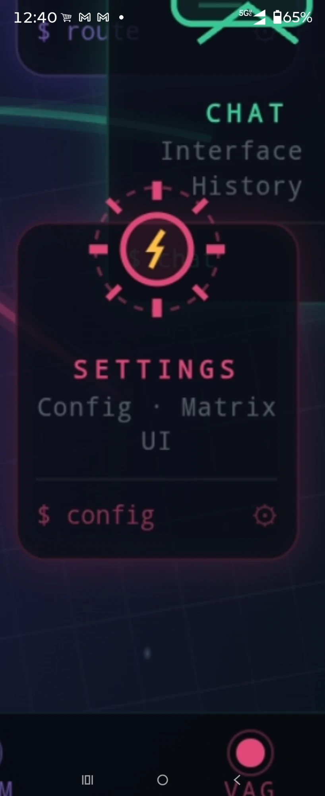
— prior build closeup — pink/crimson sun icon with yellow lightning bolt
inside a solid circle, surrounded by a dashed ring with protruding
ray/tick marks. **Exactly what Settings should look like.**

### Icon

The sun/flash icon exactly as shown in the reference: a **solid pink circle**
with a **yellow lightning bolt** inside it, surrounded by a **dashed circle
ring** with **protruding rectangular ray/tick marks** radiating outward at
regular intervals (like a sun with blocky rays). Same aspect ratio / size
proportions as all other tile icons.

### Color

**Pink/crimson** (`TileSettings` — `#FF5577`). The lightning bolt inside is
**yellow/amber**. Card interior: near-black.

### Style

- `SETTINGS` title font **bigger** than current build, same as all tiles.
- **Prompt box** needs to be **brighter, better outlined** — more contrast
  against the card background.
- Same tile card style as all others (dark black interior, colored border,
  protruding icon with backlit glow).

### Composition

```
    [SUN/FLASH ICON protruding above]


        S E T T I N G S

       /config  ·  vault

    ─────────────────────────
    $_utils                ⚙
```

---

## 5 · Center Hub — ROUTER

**Reference images:**
- ⚠ NOT YET SAVED — pic 1 (prior build full screen, same shot as §2/§3's
  target) — the **color, contrast, and hue target**. The violet crystal
  with white sun glow underneath, the purple/white contrast against the
  dark background — match this exactly. Filename:
  `27-prior-build-full-home-target.png`
-  —
  pic 2 (Agent Platform reference) — the **geometry and style target**.
  The hexagonal faceted crystal centered on an elliptical platform base
  with nodes arranged around the perimeter, connected by glowing lines.
  Match this structure.

### Crystal

The hexagonal faceted gem — **violet** with a **white sun/glow permeating
from underneath** (not a dome, not concentric rings). Match the color and
hue from pic 1 exactly — the purple contrast of the crystal against the
dark background, the warmth of the white center glow. The crystal should be
shaped like the Agent Platform gem in pic 2 — a proper 3D hexagonal faceted
gem, not an oversized "wizard hat."

### Platform base

Model after pic 2's elliptical platform: a glowing oval/elliptical base
underneath the crystal with **6 nodes** around the perimeter (one per tile
— no 3:00 or 9:00 nodes since there are only 6 tiles at 12/2/4/6/8/10).
Connected by faint glowing perimeter lines. **No bubble/dome** over the
top — just the crystal sitting on the open platform.

### Size

Small enough to **label properly with good spacing** — not stupid big. The
current build's hub is too small; the prior build's crystal was slightly
too large. This should be in between, leaning toward the prior build but
with room for the label text underneath without crowding.

### Label

Stacked under the crystal:
```
    // CORE_HUB
      ROUTER        (WHITE, not purple)
     $_Statio
```

- `// CORE_HUB` — small slug text, violet/purple at reduced opacity
- `ROUTER` — bold, **WHITE** (the one exception to purple headers)
- `$_Statio` — small, violet/purple at reduced opacity
- **No `/route`.**

---

## 6 · Connector Cords

**Reference images:**
- ⚠ NOT YET SAVED — pic 1 — closeup of the plasma tube style: glowing
  curved conduits with inner particle/data flow, nodes (small shield/lock
  icon circles) along the path, soft outer glow tapering to a bright core.
  Tubes curve organically, not straight lines. Closest existing repo asset
  in the same family: 
  — confirm with operator whether this is the same image before relying on
  it; if not, suggested filename for the actual pasted pic:
  `31-plasma-tube-shield-nodes-closeup.png`
-  —
  pic 2 (Agent Platform) — the full hub with conduits flowing outward from
  the center platform to external nodes, curving naturally around the
  geometry.

### Style

**No straight solid lines coming out of a single point.** The current build
looks like an elementary school kid traced them with a protractor — that is
wrong. The cords must be:

- **Curved / organic** — they flow from each tile toward the hub with
  natural bends, not rigid straight-line segments.
- **Plasma tube styling** — soft outer glow → bright inner core, like the
  reference images. The glow is wide and diffuse on the outside, tight and
  bright on the inside.
- **Nodes/beads along the path** — small glowing circles spaced along
  each cord, like data packets traveling through the tube.
- **Each cord in its tile's accent color** — green for Terminal, amber for
  Archives, pink for Settings, teal for Monitor, soft green for Chat,
  blue for Horizons.
- Cords connect from each of the 6 tiles into the center hub platform's
  perimeter nodes.

---

## 7 · Chat Bar / Input

**Reference image:** ⚠ NOT YET SAVED — prior build closeup — teal-bordered
rounded pill bar with `⊕` icon on left, `tap_or_hold ask //` placeholder
with blinking cursor, `↑` arrow on right. Suggested filename:
`32-chat-bar-closeup.png`

### Style

Match the reference exactly: rounded pill shape, teal border, dark
interior, monospace placeholder text. The `⊕` icon on the left, the `↑`
send arrow on the right.

### Position

**Chat bar goes ABOVE the configuration nodes** — the reference image
shows it below, but it must be swapped: chat bar on top, status nodes on
the bottom. Everything else about the bar (size, style, color, design)
stays identical to the reference.

### Hold-to-expand

**Hold** the chat bar → it expands to a **~1/3-screen mini inference UI**
(not just a navigate-to-Chat shortcut). Tap opens the Chat panel as
normal. This is why the wheel sits slightly high — to leave room for the
expansion.

---

## 8 · Configuration Nodes (System Status)

**Reference image:** ⚠ NOT YET SAVED — prior build closeup — `// SYSTEM_STATUS`
header, five large 3D glossy spheres (ASR green, LLM blue, TTS amber, MLLM
purple, VAG pink), labels underneath each. Suggested filename:
`33-status-nodes-closeup.png`

### Style

**Match the reference exactly.** The status dots must be:

- **Large** — not tiny little dots. Match the size shown in the reference.
- **3D glossy spheres** — brightly colored with a specular highlight
  (light reflection on the upper-left), giving them a dimensional,
  polished look. **NOT matte, NOT flat, NOT 2D circles.**
- **Brightly colored** — vivid, saturated colors that pop against the dark
  background. Green (ASR), blue (LLM), amber/orange (TTS), purple (MLLM),
  hot pink (VAG).
- The `// SYSTEM_STATUS` header text sits above the spheres in monospace
  at reduced opacity.
- Labels (`ASR`, `LLM`, `TTS`, `MLLM`, `VAG`) sit below each sphere in
  their matching color, bold monospace.

### Position

**Below the chat bar** (chat bar is above, status nodes are at the very
bottom of the screen, just above the gesture bar padding).

### Active vs inactive

When a module is active, its sphere is fully lit with the 3D glossy
effect. When inactive, it dims to a muted/desaturated version but keeps
the spherical shape — not a flat dot.

---

## 9 · Easter Eggs and Guardians

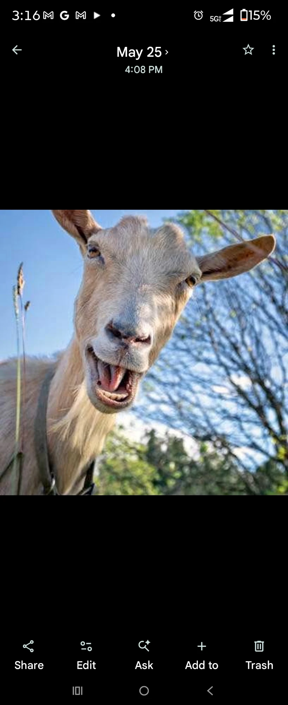
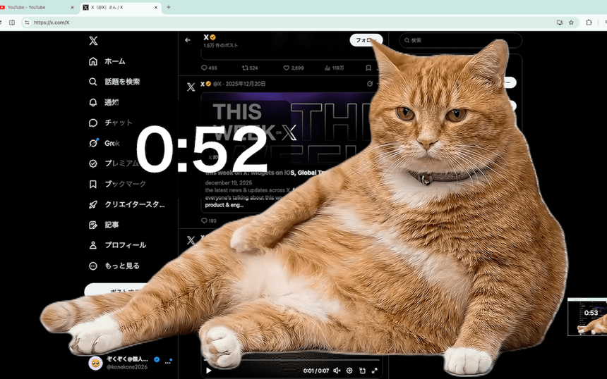

- **GOAT — crash-log easter egg.** On runtime crash/fail the goat pops up
  (`// GOAT_SAYS_NO`) with a synthesized bleat; 7 banner taps →
  `// GOAT_UNLOCKED`. Already wired (`HomeGrid.kt` `showGoat` /
  `playGoatBleat`).
- **CHONK — screen-timeout guardian.** Idle/screen-timeout screensaver loads
  the **chonky orange cat** from device storage. Partly wired
  (`Screensaver.kt`).

---

## 10 · Panel Backgrounds (separate track — mostly shipped)

Each of the 8 panels has its own background. **Nothing here is changing
right now** — all 7 tile-panel backdrops already exist as designed;
confirming the plan and clarifying which ones get uploadable-wallpaper
support.

### The four wallpaper-capable panels (this pass)

These four just need **uploadable wallpaper added** — image fully replaces
the procedural background, tiles go semi-transparent over it:

| Panel | Procedural bg (kept as default) | Reference |
|---|---|---|
| Chat | wet blue-grey slate stone | 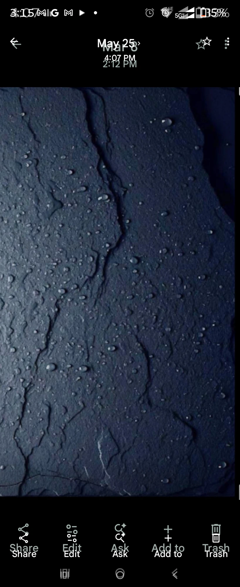 |
| Settings | brushed-steel vault door |  |
| Horizons | butterfly nebula (gold/blue-white) |  |
| Archives | vintage film strip | 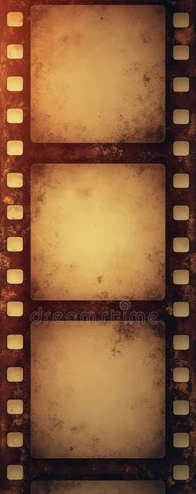 |

### The three interactive-background panels (defined LATER — not this pass)

**Monitor, Router, and Terminal are NOT simple wallpaper swaps.** Their
backgrounds are **interactive and must be rendered as one solitary unit**
— i.e. the background itself is a live, animated/functional surface (matrix
rain, oscilloscope trace, circuit-board pulse), not a static image tiles
sit on top of. **We cannot just overlay a wallpaper tab on these three** —
doing so would break the interactive rendering. These three get defined and
built at a later date, separately from this wallpaper pass.

| Panel | Interactive background | Reference |
|---|---|---|
| Terminal | Matrix rain (`fakesteak` fork) | 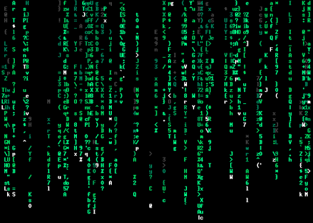 |
| Router | circuit-board / chip nodes | 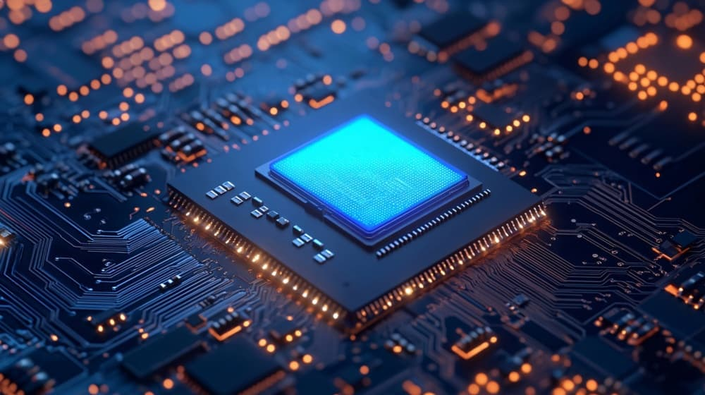 |
| Monitor | sliding oscilloscope (animated) | 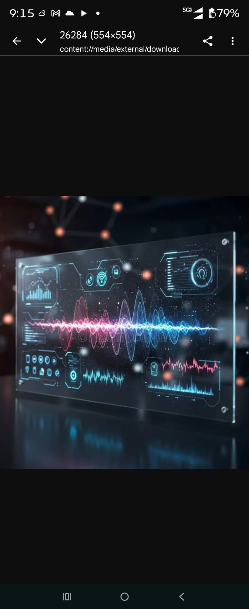 |

### Home (this spec's subject — not a "panel" background)

| Screen | Procedural bg | Reference |
|---|---|---|
| Home | astral (deep black + stars + telemetry, see §2) | 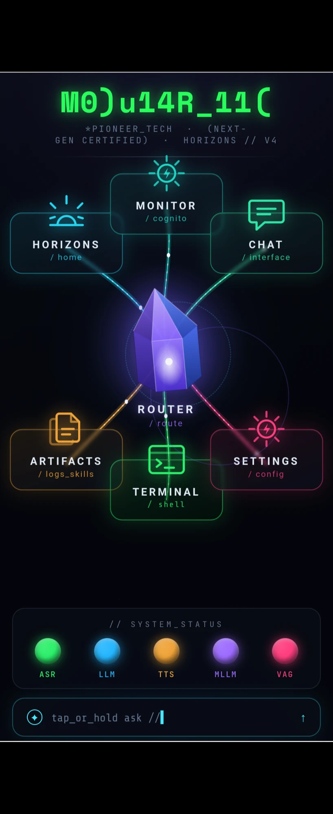 |
